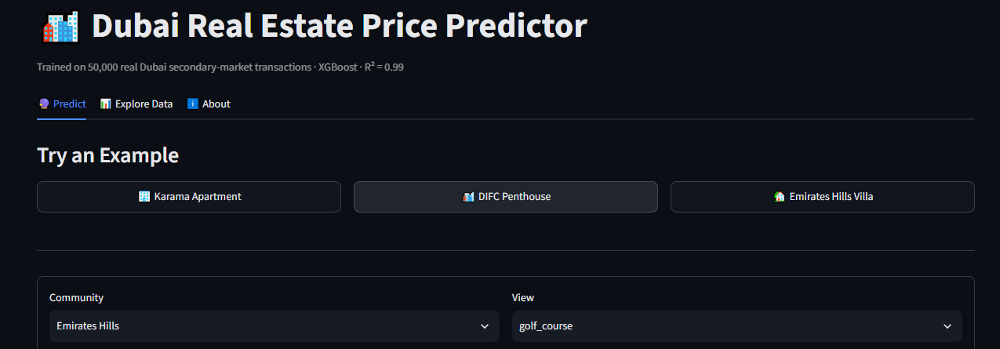
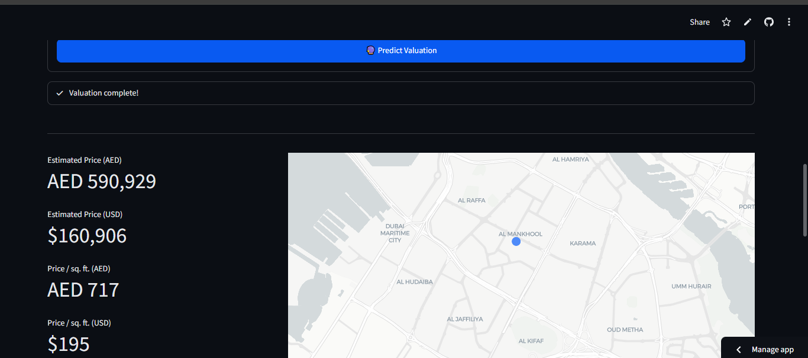
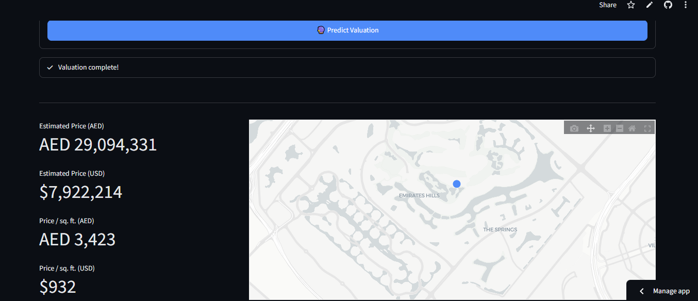
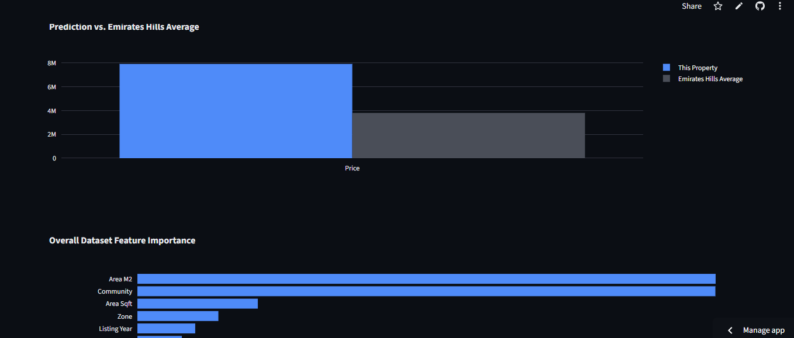

# 🏙️ Dubai Real Estate Price Predictor

An end-to-end machine learning project that predicts Dubai secondary-market property prices, from raw data to a live, deployed, interactive web app.

**🔮 Live App:** [dubai-real-estate-predictor.streamlit.app](https://dubai-real-estate-predictor.streamlit.app/)
**⚙️ API Docs:** [dubai-real-estate-predictor.onrender.com/docs](https://dubai-real-estate-predictor.onrender.com/docs)

> Note: the API runs on a free-tier server that sleeps after inactivity — the first request may take ~30-45 seconds to respond while it wakes up.



---

## Overview

This project predicts resale prices for Dubai properties using real transaction data (2020–2026). It covers the full ML lifecycle: data cleaning, feature engineering, model comparison, deployment, and a production-style frontend — not just a notebook.

**Key result:** An XGBoost model achieves **R² = 0.99** with a median prediction error of approximately **$36,700**, evaluated on a held-out test set of 10,000 real transactions.

## Tech Stack

| Layer | Tools |
|---|---|
| Data & Modeling | Python, Pandas, NumPy, scikit-learn, XGBoost |
| Backend API | FastAPI, deployed on Render |
| Frontend | Streamlit, deployed on Streamlit Community Cloud |
| Visualization | Plotly |

## Approach

1. **Data cleaning** — handled missing values (structural, e.g. villas have no floor number), removed target-leakage columns
2. **Feature engineering** — target encoding for high-cardinality categoricals (84 communities, 55 metro stations), log-transformed the price target to correct right-skew
3. **Model comparison** — Linear Regression, Random Forest, and XGBoost, evaluated on held-out test data

| Model | R² | Median $ Error |
|---|---|---|
| Linear Regression | 0.962 | $68,690 |
| Random Forest | 0.981 | $48,235 |
| **XGBoost (final)** | **0.990** | **$36,748** |

4. **Deployment** — trained model served via a FastAPI `/predict` endpoint, consumed by a Streamlit frontend with dropdown-based inputs (sourced from real dataset values, not free text), interactive maps, and comparison charts

### Example prediction

Predicting a 1-bedroom apartment in Karama — the model estimates **$160,906**, closely matching the real transaction price of $167,100 for that property.



### Handling high-value outliers

The model also scales well to luxury properties. Here's a 5-bedroom villa in Emirates Hills, shown against the community average and the model's overall feature importance:




## What drives the model

Location dominates: `community` alone accounts for ~61% of feature importance in the Random Forest model, consistent with real-world Dubai market intuition (Emirates Hills, Bulgari Resort, and Umm Suqeim top the price rankings). Property size is the second strongest driver.

## Run locally

```bash
git clone https://github.com/Alaa-elden-mohammed/Dubai-real-estate-predictor.git
cd Dubai-real-estate-predictor
pip install -r requirements.txt

# Run the API
uvicorn api:app --reload

# In a separate terminal, run the frontend
streamlit run app.py
```

## Dataset

[Dubai Real Estate: Sales & Rentals (2020–2026)](https://www.kaggle.com/datasets/sergionefedov/dubai-real-estate-sales-and-rentals-20202026) — Kaggle, 50,000 secondary-market transaction records across 84 Dubai communities.

## Author

Built by **Alaa** — [GitHub](https://github.com/Alaa-elden-mohammed)